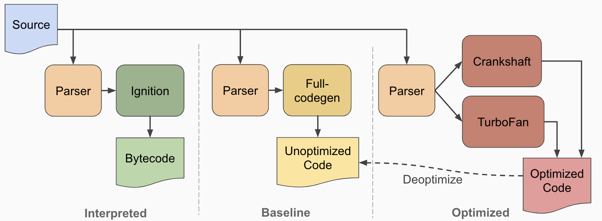
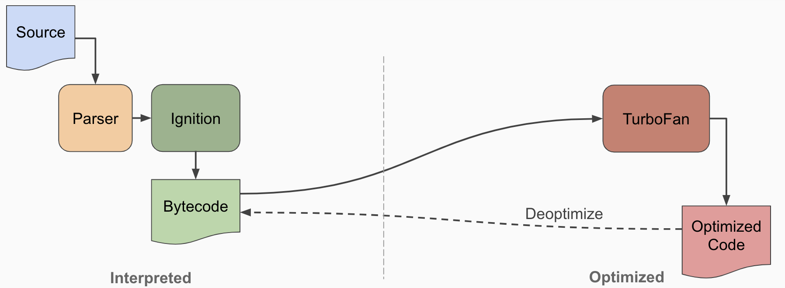

`#Interpreted_Language` `#Compiled_Language` `#Just_In_Time` `#V8`

## ✓ Trigger

자바스크립트를 공부하던 중, "자바스크립트 엔진은 코드가 실행될 때 리터럴을 평가해 값을 생성한다"는 문장을 접하고 '자바스크립트는 인터프리터 언어인가?'라는 생각이 들었다. 그래서 더 알아보다가 자바스크립트가 컴파일 언어로도 볼 수 있다는 글들을 보게 되었다. 이걸 계기로 더 깊이 서칭하게 되었고, 호기심이 생겨 추가로 알아보게 되었다.

## ✓ Overview

> **_JavaScript is an interpreted language_**, not a compiled language. A program such as C++ or Java needs to be compiled before it is run. - web.stanford.edu

소스 코드는 컴파일이라는 과정을 거쳐 기계가 실행할 수 있는 바이트코드로 변환된다. 하지만 자바스크립트는 다르게 작동한다. 컴파일 단계 없이 브라우저 내에서 인터프리터가 코드를 읽고 각 줄을 해석해 실행한다. 현대 브라우저는 종종 Just-In-Time (JIT) 컴파일을 사용해 자바스크립트를 실행 직전에 실행 가능한 바이트코드로 컴파일한다.

## ✓ After V8...

> V8 increases **_performance by compiling JavaScript_** to native machine code before executing it, versus executing bytecode or interpreting it. -V8, Chrome

자바스크립트는 정적 타입 언어가 아니라 동적 타입 언어다. 이 말은 소스 코드가 실행되기 전에 많은 값들이 알 수 없다는 뜻이다. 그래서 최적화가 어렵다. 따라서 각 코드 줄을 실행하면서 해석하는 방식, 즉 해석 접근 방식을 채택한다. 이는 다음 세 가지 이점을 고려한 것이다:

1. 메모리 사용량 감소: 자바스크립트 코드를 기계 코드로 컴파일하는 것보다 바이트코드로 컴파일하는 것이 더 편리하다.
2. 구문 분석 오버헤드 감소: 바이트코드는 간결해서 다시 구문 분석하기 쉽다.
3. 간소화된 컴파일 파이프라인: 바이트코드는 TurboFan을 통해 최적화하거나 디옵티마이징할 때도 유리하다.

### V8 architecture

### Before V8 5.9 version

V8 엔진 5.9 버전 이전에는 `Full-codegen`과 `Crankshaft`라는 두 개의 컴파일러가 있었다.

Full-codegen은 `Ignition`과 함께 자바스크립트 코드를 바이트코드로 변환해 더 빠르게 실행할 수 있게 했다. `Crankshaft`는 `TurboFan`처럼 바이트코드를 최적화된 코드로 컴파일했다.

하지만 V8 엔진의 원래 의도는 `Ignition`과 `TurboFan`만 사용하는 것이다. 초기에는 이 둘의 성능이 크게 떨어져서 `Full-codegen`과 `Crankshaft`를 함께 사용했어야 했다. 그래서 구조가 오늘날보다 훨씬 복잡해졌다.

### Now

V8 엔진이 계속 발전하면서 Ignition과 TurboFan의 성능이 크게 향상되었다. 반면에 `Full-codegen`과 `Crankshaft`는 성능 향상을 따라잡지 못했다. 그래서 5.9 버전부터 이 두 컴포넌트가 엔진에서 제거되었다.

### Interpreter-`Ignition`

Ignition은 자바스크립트 코드를 바이트코드로 변환하는 인터프리터다. 원래 소스 코드를 바이트코드로 번역해 컴퓨터가 더 쉽게 해석할 수 있게 한다. 코드를 자주 파싱할 필요를 줄이고 코드의 양을 줄여 메모리 공간을 효율적으로 관리한다.

### Compiler-`TurboFan`

TurboFan은 V8 버전 5.9 이전에 사용된 Crankshaft 컴파일러를 완전히 대체한 최적화 컴파일러다. 자바스크립트 코드를 최적화하는 역할을 한다. TurboFan은 코드를 바이트코드로 자주 변환하는 것을 최소화한다.

런타임 동안 V8은 `Profiler`에게 함수나 변수 호출 빈도와 같은 데이터를 수집하도록 지시한다. 이렇게 수집된 데이터를 활용해 TurboFan은 코드 최적화를 수행한다.

## ✓ 그렇다면 자바스크립트를 컴파일 언어로 볼 수 있을까?

- 자바스크립트는 실행 전에 JIT 컴파일을 거치지만, 전통적인 컴파일 언어와는 다르게 프로그램 실행 중 실시간으로 컴파일이 이루어진다.
- 일반적으로 컴파일 언어는 소스 코드를 한 번에 기계어로 컴파일한다. 반면 자바스크립트는 실행 중에도 컴파일을 거친다. 그래서 자바스크립트는 종종 "인터프리터 언어"로 분류되지만, JIT 컴파일을 통해 기계어로 변환되므로 컴파일 언어로도 볼 수 있다.
- 결국, 자바스크립트는 전통적인 컴파일 언어나 인터프리터 언어 어느 한쪽으로 엄밀히 분류되지 않는다.

---

### References

https://developer.mozilla.org/ko/docs/Web/JavaScript
https://v8.dev/blog/ignition-interpreter
https://web.stanford.edu/class/cs98si/slides/overview.html
https://docs.google.com/presentation/d/1OqjVqRhtwlKeKfvMdX6HaCIu9wpZsrzqpIVIwQSuiXQ/edit#slide=id.g1453eb7f19_5_51
https://en.wikipedia.org/wiki/Just-in-time_compilation
https://velog.io/@seungchan__y/자바스크립트는-Compiler-Interpreter-언어다
